# Digital Twin-Synchronized RIS Communication
## Simulated Smart Factory Environments


## Abstract

This project investigates Reconfigurable Intelligent Surface (RIS)-assisted wireless communication under high-frequency propagation conditions (mmWave/sub-THz/THz bands), with an AI-driven "Digital Twin" gain factor applied on top of the RIS-assisted channel to represent an optimization/tuning effect. RIS is relevant because it can passively reflect and focus incident signals toward a receiver, improving received power without active RF chains. The Digital Twin concept is relevant as a means of representing intelligent, model-based tuning of RIS configuration (here captured through a fixed AI gain and efficiency improvement rather than a full closed-loop synchronization system). The notebook simulates several link-level and system-level scenarios — without RIS, with RIS, and with RIS + Digital Twin (AI-enhanced) — and evaluates metrics such as SNR, latency, outage probability, coverage probability, spectral efficiency, and energy efficiency across varying RIS element counts, distances, bandwidths, and node/UAV densities.

This is a **simulation-only study**. No real-world deployment, hardware, or physical smart-factory testbed is used or claimed.

---

## Problem Statement

High-frequency wireless links (mmWave/sub-THz/THz), which offer large bandwidth for dense, latency-sensitive environments, suffer from severe path loss, blockage sensitivity, and atmospheric/gaseous absorption. In an industrial or smart-factory-style setting, ensuring reliable, low-latency coverage between transmitters and receivers over these frequencies is difficult using direct line-of-sight links alone. This project models how introducing a RIS between transmitter and receiver affects received power, SNR, latency, outage, coverage, spectral efficiency, and energy efficiency, and further models a hypothetical AI/Digital-Twin-driven efficiency and gain improvement on top of the RIS-assisted link.

---

## Objectives

- Model RIS-assisted wireless communication using free-space path loss and RIS array-gain formulations
- Model atmospheric/gaseous attenuation effects on high-frequency links (ITU-R P.676 gaseous attenuation, via the `itur` package)
- Evaluate the effect of the number of RIS elements (N) on SNR, coverage probability, spectral efficiency, and energy efficiency
- Evaluate latency and outage probability across distance, bandwidth, and user/UAV density
- Compare three configurations throughout: **Without RIS**, **With RIS**, and **With RIS + Digital Twin (AI-enhanced)**
- Represent the Digital Twin/AI component as a fixed gain factor (`ai_gain_db`) and an improved RIS efficiency term (`eta_ai` vs `eta_ris`), rather than a full real-time synchronization system

---

## Proposed Approach

```
Smart Factory (simulated scenario context)
        ↓
Factory Machines / Nodes (modeled as Tx/Rx or user density in the link budget)
        ↓
Wireless Environment (free-space path loss + gaseous/atmospheric attenuation)
        ↓
RIS (passive reflecting array, N elements, efficiency η)
        ↓
Base Station / Receiver
        ↓
Performance Evaluation (SNR, latency, outage, coverage, spectral efficiency, energy efficiency)
```

The **Digital Twin** component in this notebook is represented conceptually — as a fixed AI gain (`ai_gain_db = 2.0 dB` in most cells) and a higher RIS efficiency value (`eta_ai`, typically 0.88–0.9 vs. `eta_ris` = 0.8) applied to the RIS-assisted channel, to approximate the benefit of AI/twin-driven configuration optimization. **No real-time synchronization loop, live twin-to-physical feedback, or learning/optimization algorithm is implemented in the notebook** — this should be treated as a **conceptual/proposed** representation of a Digital Twin's effect, not an implemented twin system.

---

## System Architecture


- **Smart Factory** — the simulated deployment context motivating the parameter choices (short distances, high-frequency bands); not modeled as an explicit factory floor/geometry.
- **Machines / UEs** — represented in the link budget as the receiver side of the channel, or via a `user_density` sweep in one experiment (latency vs. user density).
- **RIS** — modeled as an array of `N` reflecting elements with an efficiency `η`, contributing an `N²` gain term to received power in the RIS-assisted path-loss formulas.
- **Base Station** — the receiver endpoint of the modeled link, characterized by receiver gain, noise figure, and bandwidth.
- **Wireless Channel** — free-space path loss (FSPL), and in several cells, ITU-R gaseous/atmospheric attenuation added on top of FSPL.
- **Digital Twin** — represented as a fixed AI gain factor and an improved efficiency parameter applied to the RIS-assisted channel (**conceptual**, not a live twin implementation).
- **Performance Evaluation** — SNR, latency, outage probability, coverage probability, spectral efficiency, and energy efficiency, computed and plotted for each scenario.

---

## Methodology

1. Define physical/system constants (speed of light, Boltzmann constant, temperature) per experiment cell
2. Configure carrier frequency, bandwidth, transmit power, and receiver noise figure
3. Define transmitter–RIS and RIS–receiver (or direct) distances
4. Model wireless propagation: free-space path loss, and in some cells, ITU-R P.676 gaseous attenuation via `itur`
5. Configure RIS parameters: number of elements (N), efficiency (η)
6. Apply the Digital Twin/AI concept as a fixed gain (`ai_gain_db`) and improved efficiency (`eta_ai`)
7. Compute received power / SNR for each scenario (No RIS / RIS / RIS + Digital Twin)
8. Calculate performance metrics: SNR, latency, outage probability, coverage probability, spectral efficiency, energy efficiency
9. Generate publication-style Matplotlib plots (300 DPI) for each experiment
10. Compare scenarios within each plot (Without RIS vs. With RIS vs. With RIS + Digital Twin)

---

## Simulation Parameters

Parameter values vary by experiment cell in the notebook (each cell defines its own system constants). Representative values actually found in the notebook:

| Parameter | Value |
|---|---|
| Carrier Frequency | Varies by cell: 140 GHz, 3.5 GHz, 28 GHz, 300 GHz, 1 THz (0.0035 THz band also used) |
| Bandwidth | Varies by cell: 100 MHz, 1 GHz, 4.32 GHz, or swept 0.1–10 GHz |
| Transmit Power | Varies by cell: 20 dBm, 21.9 dBm, 23 dBm, 30 dBm |
| Receiver Noise Figure | Varies by cell: 6–9.56 dB |
| RIS Elements (N) | Varies by experiment: fixed values {1, 4, 16, 64, 256, 1024, 4096}, swept ranges (10–500, 16–1024), or log-spaced sweeps |
| RIS Efficiency (η) | 0.8 (With RIS); 0.88–0.9 (With RIS + Digital Twin) |
| AI/Digital Twin Gain | 2.0 dB (`ai_gain_db`), applied as a linear multiplier on RIS-assisted received power |
| Number of Machines/Nodes | Not explicitly specified (one experiment sweeps `user_density` from 1–50 users per 100 m² as a proxy) |
| Propagation Model | Free-space path loss (FSPL); ITU-R P.676 gaseous attenuation (`itur.models.itu676.gaseous_attenuation_terrestrial_path`) in select cells; empirical atmospheric attenuation coefficient (5.2 dB/km) in others |
| Environment | Not explicitly specified (no factory geometry, materials, or blockage model implemented) |
| Tx–RIS / RIS–Rx Distances | Varies by cell: 5 m, 15 m, or swept 1–500 m |

---

## Experimental Scenarios

The notebook actually implements the following comparative experiments:

- **SNR vs. Number of RIS Elements (N)** — Without RIS is not shown in this cell; compares With RIS vs. With RIS + Digital Twin across N = 1 to 4096
- **Latency vs. User Density** — compares Without RIS, With RIS, and RIS + Digital Twin as user density increases from 1 to 50
- **Outage Probability vs. Average SNR** — Rician fading model; compares Without RIS, With RIS, and With RIS + Digital Twin using fixed gain multipliers
- **Latency vs. Bandwidth** — compares With RIS vs. With RIS + Digital Twin (AI) as bandwidth is swept 100 MHz–10 GHz, incorporating ITU-R gaseous attenuation
- **Latency vs. Distance** — compares Without RIS, With RIS, and With RIS + Digital Twin (AI) as Tx–Rx distance is swept 1–500 m, with an empirical atmospheric attenuation coefficient
- **Coverage Probability vs. Number of UAVs (M)** — compares Without RIS (direct path), With RIS, and RIS + Digital Twin as the number of UAV nodes is swept
- **Coverage Probability vs. Number of RIS Elements (N)** — compares Without RIS, With RIS, and RIS + Digital Twin across a log-spaced sweep of N
- **Latency vs. Number of RIS Elements (N)** — compares With RIS vs. RIS + Digital Twin (Optimized) across N = 16 to 1024
- **Throughput vs. Number of RIS Elements** — compares With RIS vs. RIS + Digital Twin across N = 10 to 500
- **Spectral Efficiency vs. Number of RIS Elements (N)** — compares With RIS vs. RIS + Digital Twin across N = 1 to 4096
- **Energy Efficiency vs. Number of RIS Elements (N)** — compares With RIS vs. RIS + Digital Twin across N = 1 to 4096, incorporating a per-element power consumption model

No comparisons across different environmental/weather conditions, different RIS array geometries, or multi-RIS deployments are implemented.

---

## Results

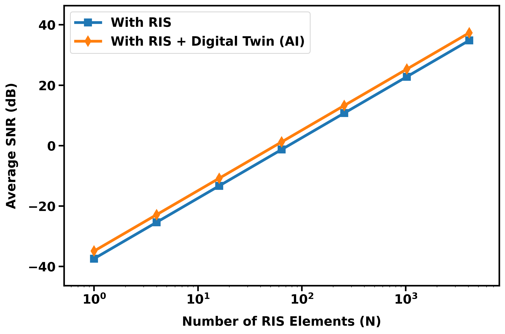

### Result 1 — Average SNR vs. Number of RIS Elements
Shows average SNR (dB) increasing with the number of RIS elements on a log-x scale, comparing the RIS-only and RIS + Digital Twin configurations.

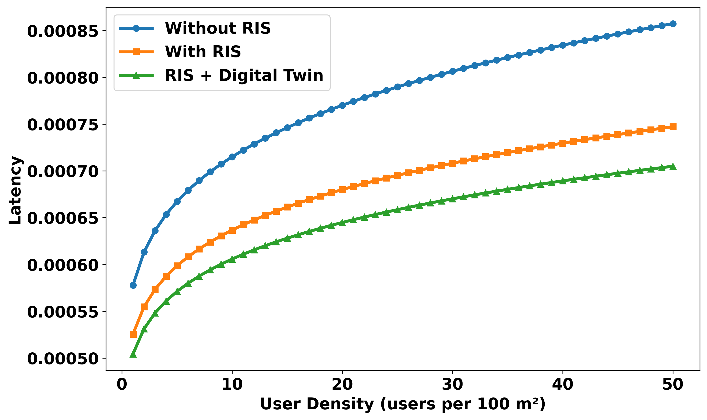

### Result 2 — Latency vs. User Density
Compares latency across Without RIS, With RIS, and RIS + Digital Twin as user density increases, with transmit power divided among users.

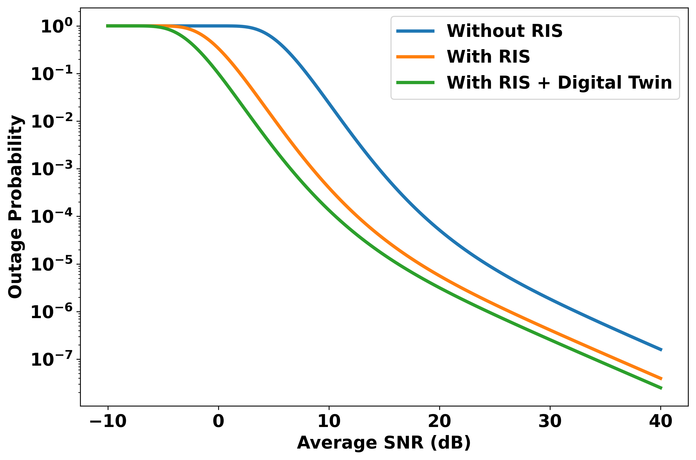

### Result 3 — Outage Probability vs. Average SNR
Semi-log plot of outage probability under Rician fading, comparing the three configurations using fixed SNR gain multipliers for RIS and RIS + Digital Twin.

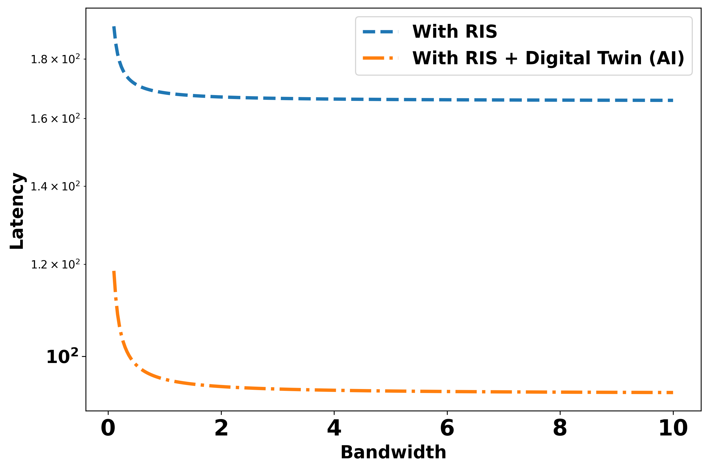

### Result 4 — Latency vs. Bandwidth
Compares latency for RIS vs. RIS + Digital Twin as available bandwidth is swept, incorporating ITU-R gaseous attenuation at the modeled carrier frequency.

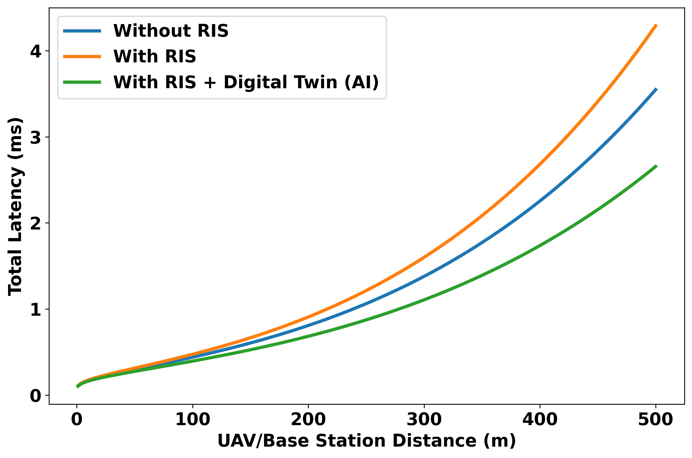

### Result 5 — Latency vs. Distance
Compares total latency (transmission + propagation) across the three configurations as Tx–Rx distance increases, using an empirical atmospheric attenuation coefficient.

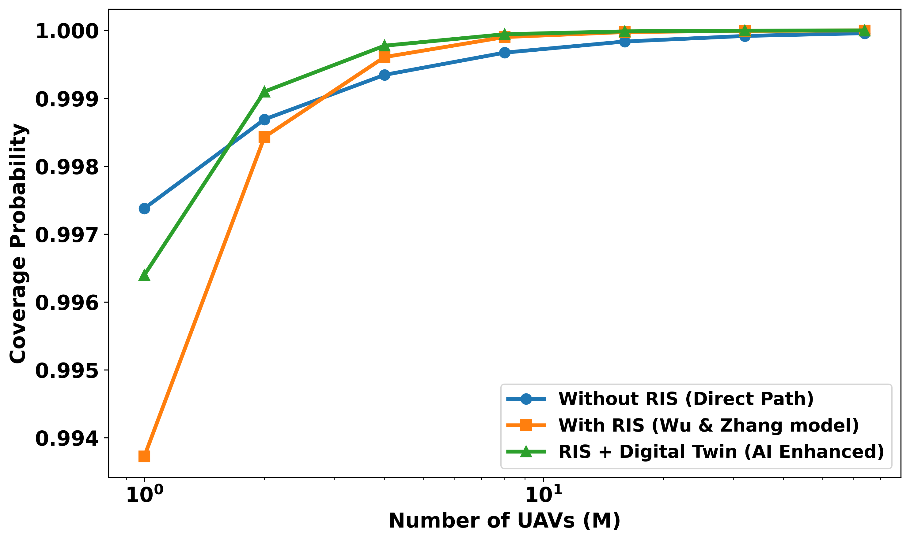

### Result 6 — Coverage Probability vs. Number of UAVs
Compares coverage probability across the three configurations as the number of UAV nodes increases and average inter-node distance shrinks.

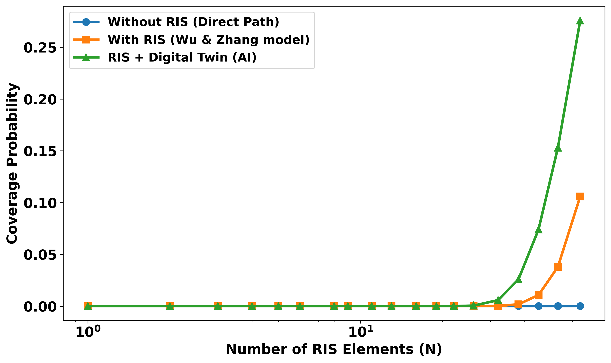

### Result 7 — Coverage Probability vs. Number of RIS Elements
Compares coverage probability across the three configurations over a log-spaced sweep of RIS element counts.

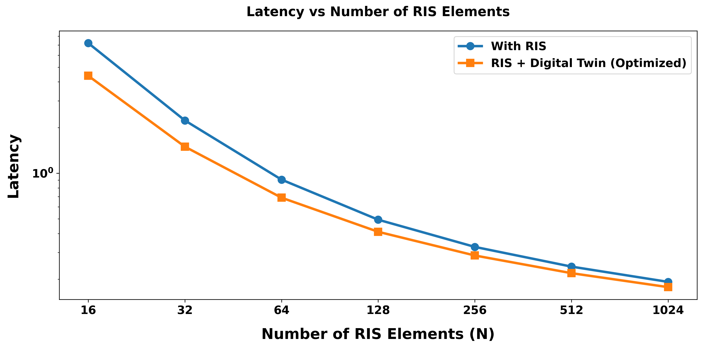

### Result 8 — Latency vs. Number of RIS Elements
Compares latency for With RIS vs. RIS + Digital Twin (Optimized) as N increases from 16 to 1024, on a log latency scale.

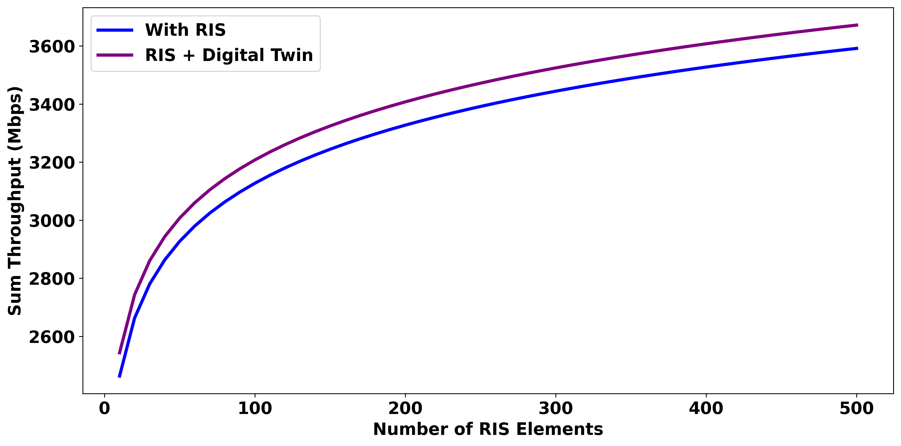

### Result 9 — Sum Throughput vs. Number of RIS Elements
Compares sum throughput (Mbps) for With RIS vs. RIS + Digital Twin as N increases from 10 to 500.

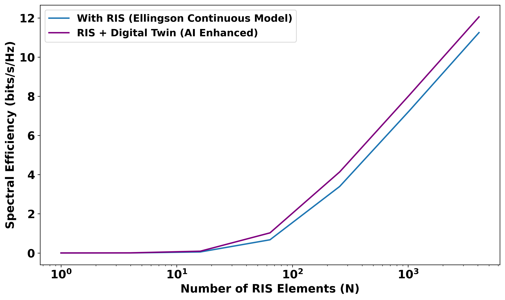

### Result 10 — Spectral Efficiency vs. Number of RIS Elements
Compares spectral efficiency (bits/s/Hz) for With RIS vs. RIS + Digital Twin on a log-x scale of N.

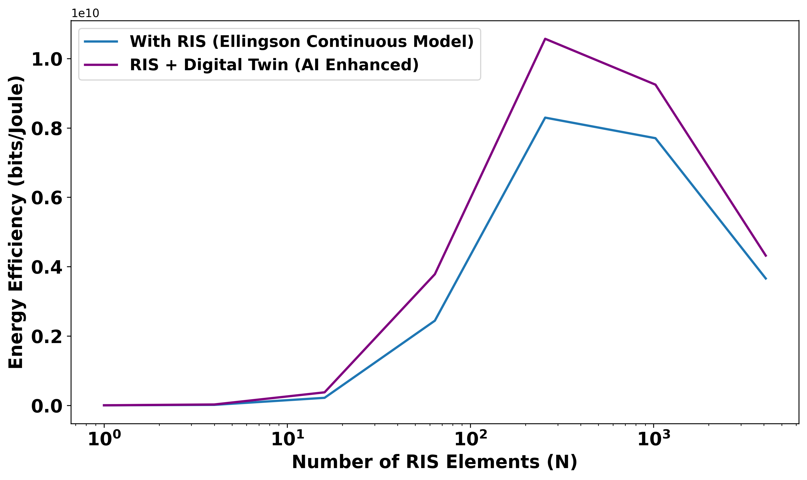

### Result 11 — Energy Efficiency vs. Number of RIS Elements
Compares energy efficiency (bits/Joule) for With RIS vs. RIS + Digital Twin, accounting for per-RIS-element power consumption.

---

## Key Findings

- Increasing the number of RIS elements (N) improves SNR, coverage probability, and spectral efficiency across the tested range in every relevant experiment
- Latency decreases as the number of RIS elements increases, in both the RIS-only and RIS + Digital Twin configurations
- In every plotted comparison, the RIS + Digital Twin configuration (which uses a higher efficiency `eta_ai` and a fixed +2 dB AI gain) shows lower latency / higher SNR / higher coverage than the RIS-only configuration, by construction of the applied gain and efficiency parameters
- Outage probability decreases substantially when RIS or RIS + Digital Twin gain multipliers are applied to the Rician-faded SNR, compared to the no-RIS case
- Energy efficiency accounts for per-element RIS power consumption, so gains from adding more elements are partially offset by increased power draw
- These RIS + Digital Twin improvements are a direct consequence of the fixed gain/efficiency parameters chosen in the notebook, not the output of a learned or closed-loop optimization process

---

## Technologies Used

| Technology | Purpose |
|---|---|
| Python | Core implementation |
| NumPy | Numerical computation (arrays, log/exp operations, sweeps) |
| SciPy (`scipy.stats.ncx2`) | Non-central chi-squared CDF for Rician outage probability calculation |
| Matplotlib | Visualization (all result plots) |
| itur | ITU-R P.676 gaseous/atmospheric attenuation modeling |
| astropy (`astropy.units`) | Unit handling for the ITU-R propagation model |
| math | Scalar math operations in several cells |

---

## Project Structure

```
digital-twin-ris-smart-factory/
│
├── README.md
├── Digital_Twin_RIS_Simulation.ipynb
├── requirements.txt
│
├── results/
│   ├── avg_snr_vs_num_ris_elements.png
│   ├── latency_vs_user_density.png
│   ├── outage_probability_vs_avg_snr.png
│   ├── latency_vs_bandwidth.png
│   ├── latency_vs_distance.png
│   ├── coverage_probability_vs_num_uavs.png
│   ├── coverage_probability_vs_num_ris_elements.png
│   ├── latency_vs_num_ris_elements.png
│   ├── throughput_vs_num_ris_elements.png
│   ├── spectral_efficiency_vs_num_ris_elements.png
│   └── energy_efficiency_vs_num_ris_elements.png
│
└── figures/
    └── system_architecture.png
```

- **README.md** — this document
- **Digital_Twin_RIS_Simulation.ipynb** — the complete, unmodified research notebook (primary source of truth)
- **requirements.txt** — Python dependencies needed to run the notebook
- **results/** — plots generated directly by the notebook's code cells
- **figures/** — supporting conceptual diagram(s) for documentation purposes only (not a notebook output)

> **Note:** `figures/system_architecture.png` is a documentation diagram and is not generated by the notebook — it is not present in your current repository contents and will need to be created or added separately before the README image links will resolve.

---

## How to Run

```bash
git clone <repository-url>
cd digital-twin-ris-smart-factory
pip install -r requirements.txt
jupyter notebook
```

Open `Digital_Twin_RIS_Simulation.ipynb` and run all cells in order to reproduce the results in `results/`.

---

## Limitations

- The Digital Twin is represented as a fixed gain/efficiency parameter, not an implemented real-time synchronization or learning system — this should be treated as **conceptual/proposed**
- No explicit smart-factory geometry, machine layout, blockage, or multipath/scattering model is implemented
- Each experiment cell defines its own independent set of system constants (frequency, power, bandwidth, etc.), so parameters are **not held consistent across all plots**
- No statistical significance testing is performed on any result
- No real-world hardware, measurement data, or deployment validation is included; this is a purely numerical/analytical simulation
